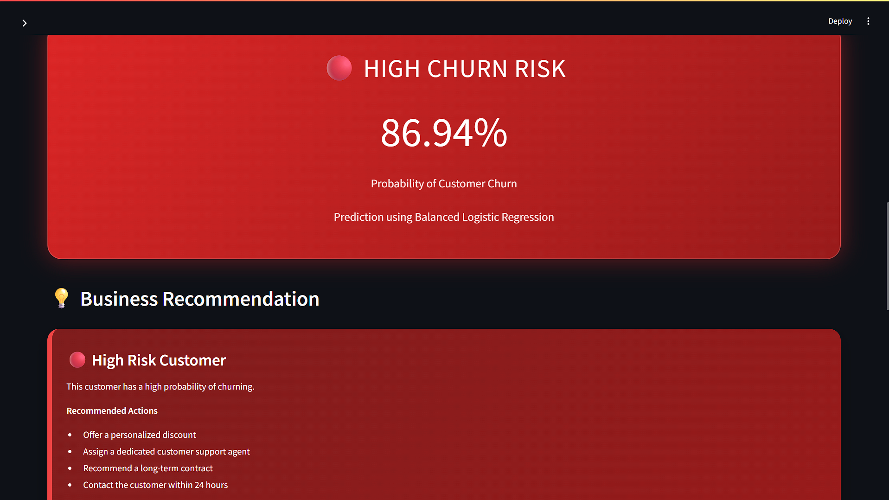
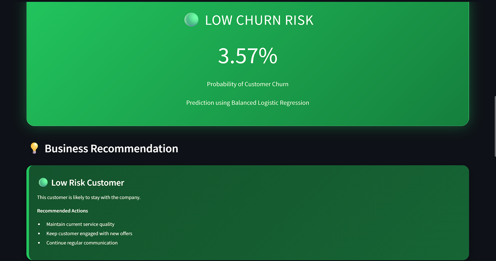
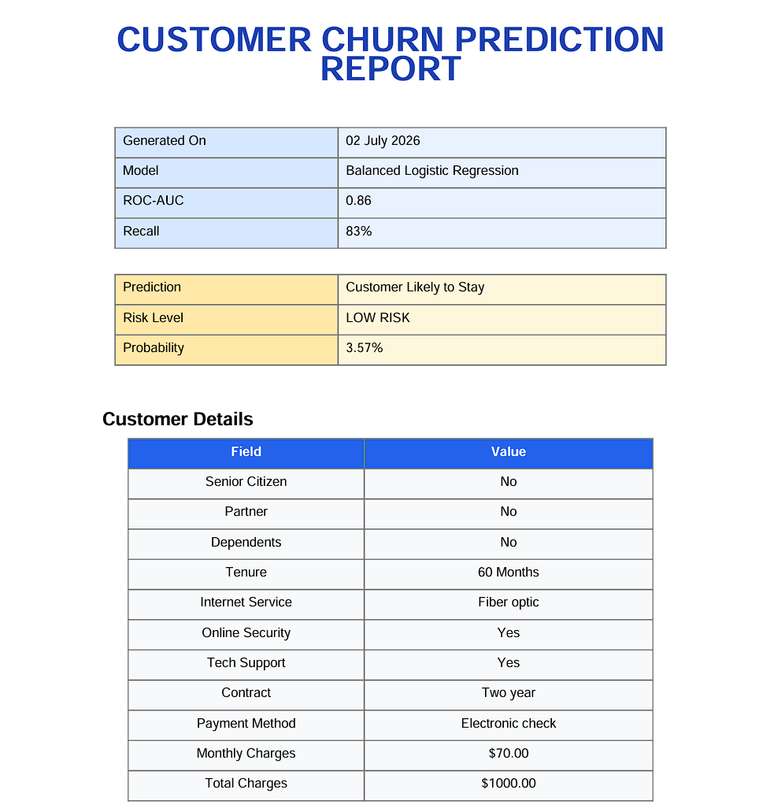

<p align="center">


</p>

<h1 align="center">
📊 Customer Churn Prediction using Machine Learning
</h1>

<p align="center">
  
</p>

<p align="center">

An end-to-end Machine Learning application that predicts telecom customer churn and provides business recommendations through an interactive Streamlit dashboard.

</p>

---

## 🚀 Live Demo

🌐 **Web Application:** https://customer-churn-prediction-53klmerjuephvm8gikubjr.streamlit.app

---

## 📖 Overview

Customer churn is one of the most critical business challenges in the telecom industry. Identifying customers who are likely to leave enables companies to take proactive retention measures.

This project uses a **Balanced Logistic Regression** model to predict customer churn based on customer demographics, subscription information, and billing history.

In addition to churn prediction, the application provides:

- 📈 Churn Probability Score
- 🔴🟡🟢 Risk Classification
- 💡 Personalized Business Recommendations
- 📋 Prediction Explanation
- 📄 Professional PDF Report
- 📊 Customer Summary Dashboard

---

# ✨ Key Features

- ✅ End-to-End Machine Learning Pipeline
- ✅ Interactive Streamlit Dashboard
- ✅ Balanced Logistic Regression Model
- ✅ Customer Churn Probability
- ✅ High / Medium / Low Risk Detection
- ✅ Business Recommendation Engine
- ✅ Explainable Predictions
- ✅ Automated PDF Report Generation
- ✅ Responsive Dark-Themed UI
- ✅ Modular Python Code Structure

---

# 📷 Application Preview

## 🏠 Home Page


---

## 🔴 High Risk Prediction



---

## 🟢 Low Risk Prediction



---

## 📄 PDF Report



---

# ⚙ Machine Learning Pipeline

```
Raw Dataset
      │
      ▼
Data Cleaning
      │
      ▼
Exploratory Data Analysis
      │
      ▼
Feature Engineering
      │
      ▼
Data Preprocessing
      │
      ▼
Model Training
      │
      ▼
Hyperparameter Tuning
      │
      ▼
Model Evaluation
      │
      ▼
Deployment using Streamlit
```

---

# 📈 Model Performance

| Metric | Score |
|---------|------:|
| ROC-AUC Score | **0.86** |
| Recall | **83%** |
| Algorithm | **Balanced Logistic Regression** |

---

# 🛠 Tech Stack

| Category | Technologies |
|-----------|--------------|
| Language | Python |
| Machine Learning | Scikit-learn, Logistic Regression |
| Data Processing | Pandas, NumPy |
| Web Framework | Streamlit |
| Model Serialization | Joblib |
| Report Generation | ReportLab |
| Styling | HTML, CSS |

---

# 📂 Project Structure

```text
Customer_Churn_Prediction/

├── assets/
│   ├── logo.png
│   └── style.css
│
├── data/
│   └── Telco_Customer_Churn.csv
│
├── models/
│   ├── churn_prediction_model.pkl
│   ├── scaler.pkl
│   └── Columns.pkl
│
├── screenshots/
│   ├── Home_Page.png
│   ├── High_Risk_Prediction.png
│   ├── Low_Risk_Prediction.png
│   └── PDF_Report.png
│
├── utils/
│   ├── prediction.py
│   ├── recommendation.py
│   ├── explain.py
│   ├── report.py
│   └── summary.py
│
├── app.py
├── README.md
├── requirements.txt
└── .gitignore
```

---

# 📊 Dataset

**Dataset:** IBM Telco Customer Churn Dataset

**Target Variable:**

- Churn (Yes / No)

**Records:**

- 7,043 Customers

---

# 📄 PDF Report

The application generates a downloadable business report containing:

- Customer Information
- Churn Prediction
- Churn Probability
- Risk Classification
- Key Factors Behind Prediction
- Business Recommendations
- Report Metadata

---

# 💻 Installation

Clone the repository

```bash
git clone https://github.com/rayansingh955/customer-churn-prediction.git
```

Move to the project directory

```bash
cd customer-churn-prediction
```

Install dependencies

```bash
pip install -r requirements.txt
```

Run the application

```bash
streamlit run app.py
```

---

# 🚀 Future Improvements

- SHAP Explainability
- Batch CSV Prediction
- REST API using FastAPI
- Docker Support
- Cloud Deployment
- Multiple ML Model Comparison
- Authentication System

---

# 👨‍💻 Developer

## Rayan Singh

**B.Tech Computer Science & Engineering**

Aspiring **Data Analyst | Machine Learning Enthusiast**

---

If you found this project helpful, consider giving it a ⭐ on GitHub.
